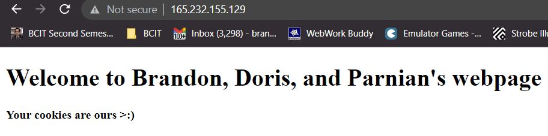

# 2420_week12_Lab
By Brandon Woo, Yingyi (Doris) He, Parnian Azarm

## Prerequisites
- A successful DO Server with ssh
- Sudo access on the server


## 1. Tutorial

### Step 1: Install Nginx
- Before installing Nginx, you should update your server. Use this command on your Digital Ocean Server:
```
sudo apt update
```

- Then upgrade with:
```
sudo apt upgrade
```

- You might have to restart some libraries. In that case just the default (press TAB and hit ENTER)


- Run the command:
```
sudo apt install nginx
```


- Again, Ubuntu might ask you to restart libraries. Hit TAB and press ENTER


### Step 2: Create an HTML Document
- On your host machine, create an HTML document with the following code named `index.html`:
```
<!DOCTYPE html>
<html lang="en">
<html>
    <head>
        <meta charset="UTF-8" />
        <title>My Landing Page</title>
    </head>
    <body>
        <h1>Welcome to Brandon, Doris, and Parnian's webpage </h1>
        <b>Your cookies are ours >:)</b>
    </body>
</html>
```


### Step 3: Write an nginx server block
- Create an nginx server block file (named with your server's ip address e.g., 165.232.155.129) with the following code:
```
server {
        listen 80;
        listen [::]:80;

        root /var/www/165.232.155.129/html;
        index index.html;

        server_name 165.232.155.129;

        location / {
                try_files $uri $uri/ =404;
        }
}
```
>Make sure to change the `server_name` value to the IP address of your digital ocean server. Change the `root` value as well.


### Step 4: Upload files to server using SFTP and Moving Files
- Connect to your server using sftp on your local host with:
```
sftp -i "~/.ssh/DO_key" puddle@165.232.155.129
```


- Use the `put` command to move the index.html file and the server block file to the server
```
put index.html
put 165.232.155.129
```

- The files should be in your server's home directory


- ssh into your server. Then, move the server block file to `/etc/nginx/sites-available`
```
sudo mv 165.232.155.129 /etc/nginx/sites-available
```


- run the command:

```
sudo mkdir /var/www/165.232.155.129 && sudo mkdir /var/www/165.232.155.129/html
```


- move the index.html file to the newly created directory

```
sudo mv index.html /var/www/165.232.155.129/html
```


- Create a symbolic link to the new server block
```
sudo ln -s /etc/nginx/sites-available/165.232.155.129 /etc/nginx/sites-enabled/
```


- Make sure that your nginx syntax is correct with:
```
sudo nginx -t
```


### Step 5: Starging the Service
- Reload your daemon:
```
sudo systemctl daemon-reload
```


- Start the nginx service
```
sudo systemctl start nginx
```


- Reload the nginx service
```
sudo sysctemctl reload nginx
```


### Step 6: Check to see if you can connect to the server via HTTP
- Visit the IP in your browser: It should look like this


### Step 7: Create the Firewall
- Go to the DigitalOcean website and select your project
- Click the create button in the top right

- Scroll down and select cloud firewall

- Name the firewall 'web-one-firewall'
- In the "Inbound rules" select new rule and choose the HTTP option

> This will allow all HTTP requests to go through to your server. SSH will already be there by default. Everything else will be dropped

- Scroll down and apply the firewall to your droplet


## Step 8: Checking if everything works
- Check you can still connect to the server on your browser


- Ensure you can still ssh into the server


